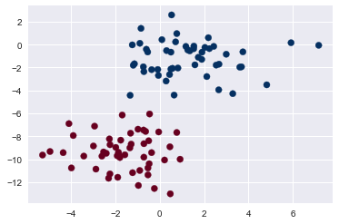
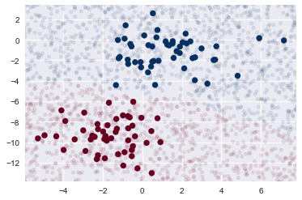
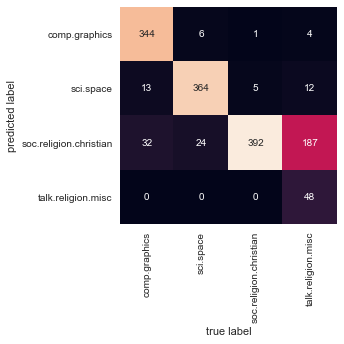

# Naive Bayes Classification

##### reference : 파이썬 데이터 사이언스 핸드북 / 437p-444p


```python
%matplotlib inline

import numpy as np
import matplotlib.pyplot as plt
import seaborn as sns; sns.set()
```

## Example : Gaussian Naive Bayes


```python
from sklearn.datasets import make_blobs
X, y = make_blobs(100, 2, centers=2, random_state=2, cluster_std=1.5)
plt.scatter(X[:,0], X[:,1], c=y, s=50, cmap='RdBu')
```


    <matplotlib.collections.PathCollection at 0x1e34bc9e7f0>





```python
from sklearn.naive_bayes import GaussianNB
model = GaussianNB()
model.fit(X,y)
```


    GaussianNB(priors=None)


```python
rng = np.random.RandomState(0)
Xnew = [-6, -14] +[14,18] * rng.rand(2000,2)
ynew = model.predict(Xnew)
```


```python
plt.scatter(X[:,0], X[:,1], c=y, s=50, cmap='RdBu')
lim = plt.axis()
plt.scatter(Xnew[:,0], Xnew[:,1], c=ynew, s=20, cmap='RdBu', alpha=0.1)
plt.axis(lim)
```


    (-5.902170524311957, 7.789182875858786, -13.793829460308247, 3.381339464828492)





```python
yprob = model.predict_proba(Xnew)
yprob[-8:].round(2)
```


    array([[0.89, 0.11],
           [1.  , 0.  ],
           [1.  , 0.  ],
           [1.  , 0.  ],
           [1.  , 0.  ],
           [1.  , 0.  ],
           [0.  , 1.  ],
           [0.15, 0.85]])


## Example : Multinomial Naive Bayes


```python
from sklearn.datasets import fetch_20newsgroups
data = fetch_20newsgroups()
data.target_names
```


    ['alt.atheism',
     'comp.graphics',
     'comp.os.ms-windows.misc',
     'comp.sys.ibm.pc.hardware',
     'comp.sys.mac.hardware',
     'comp.windows.x',
     'misc.forsale',
     'rec.autos',
     'rec.motorcycles',
     'rec.sport.baseball',
     'rec.sport.hockey',
     'sci.crypt',
     'sci.electronics',
     'sci.med',
     'sci.space',
     'soc.religion.christian',
     'talk.politics.guns',
     'talk.politics.mideast',
     'talk.politics.misc',
     'talk.religion.misc']


```python
categories = ['talk.religion.misc', 'soc.religion.christian','sci.space','comp.graphics']
train = fetch_20newsgroups(subset='train', categories=categories)
test = fetch_20newsgroups(subset='test', categories=categories)
```


```python
print(train.data[5])
```

    From: dmcgee@uluhe.soest.hawaii.edu (Don McGee)
    Subject: Federal Hearing
    Originator: dmcgee@uluhe
    Organization: School of Ocean and Earth Science and Technology
    Distribution: usa
    Lines: 10
    
    
    Fact or rumor....?  Madalyn Murray O'Hare an atheist who eliminated the
    use of the bible reading and prayer in public schools 15 years ago is now
    going to appear before the FCC with a petition to stop the reading of the
    Gospel on the airways of America.  And she is also campaigning to remove
    Christmas programs, songs, etc from the public schools.  If it is true
    then mail to Federal Communications Commission 1919 H Street Washington DC
    20054 expressing your opposition to her request.  Reference Petition number
    
    2493.
    
    


```python
from sklearn.feature_extraction.text import TfidfVectorizer
from sklearn.naive_bayes import MultinomialNB
from sklearn.pipeline import make_pipeline
model = make_pipeline(TfidfVectorizer(), MultinomialNB())
model.fit(train.data, train.target)
labels = model.predict(test.data)
```


```python
from sklearn.metrics import confusion_matrix
mat = confusion_matrix(test.target, labels)
sns.heatmap(mat.T, square=True, annot=True, fmt='d', cbar=False,
           xticklabels=train.target_names, yticklabels=train.target_names)
plt.xlabel('true label')
plt.ylabel('predicted label')
```


    Text(92.68,0.5,'predicted label')





```python
def predict_category(s, train=train, model=model):
    pred = model.predict([s])
    return train.target_names[pred[0]]
```


```python
predict_category('sending a payload to the ISS')
```


    'sci.space'


```python
predict_category('discussing islam vs atheism')
```


    'soc.religion.christian'


```python
predict_category('determining the screen resolution')
```


    'comp.graphics'


