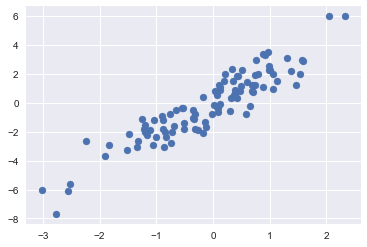
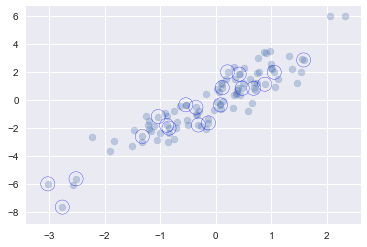
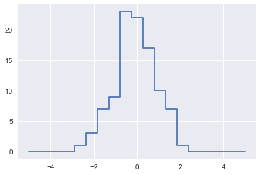
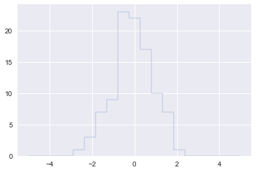

# NumPy

##### 참고 : 파이썬 데이터 사이언스 핸드북 89p-98p

```python
import numpy as np
```

<br>

### 팬시 인덱싱

> 인덱스로 배열에 접근

<br>

##### In
```python
rand = np.random.RandomState(42)
x = rand.randint(100, size=10)
x
```
##### Out
    array([51, 92, 14, 71, 60, 20, 82, 86, 74, 74])

<br>

##### In
```python
[x[3], x[7], x[2]]
```
##### Out
    [71, 86, 14]

<br>

##### In
```python
ind = [3,7,4]
x[ind]
```
##### Out
    array([71, 86, 60])

<br>

##### In
```python
ind = np.array([[3,7],[4,5]])
x[ind]
```
##### Out
    array([[71, 86],
           [60, 20]])

<br>

##### In
```python
X = np.arange(12).reshape((3,4))
X
```
##### Out
    array([[ 0,  1,  2,  3],
           [ 4,  5,  6,  7],
           [ 8,  9, 10, 11]])

<br>

##### In
```python
row = np.array([0,1,2])
col = np.array([2,1,3])
X[row, col]
```
##### Out
    array([ 2,  5, 11])

<br>

##### In
```python
X[row[:,np.newaxis], col]
```
##### Out
    array([[ 2,  1,  3],
           [ 6,  5,  7],
           [10,  9, 11]])

<br>

##### In
```python
row[:, np.newaxis] * col
```
##### Out
    array([[0, 0, 0],
           [2, 1, 3],
           [4, 2, 6]])

<br>

### 결합 인덱싱

##### In
```python
X
```
##### Out
    array([[ 0,  1,  2,  3],
           [ 4,  5,  6,  7],
           [ 8,  9, 10, 11]])

<br>

##### In
```python
X[2, [2,0,1]]
```
##### Out
    array([10,  8,  9])

<br>

##### In
```python
X[1:, [2,0,1]]
```
##### Out
    array([[ 6,  4,  5],
           [10,  8,  9]])

<br>

##### In
```python
mask = np.array([1,0,1,0], dtype=bool)
X[row[:, np.newaxis], mask]
```
##### Out
    array([[ 0,  2],
           [ 4,  6],
           [ 8, 10]])

<br>

### 예제 : 임의의 점 선택하기

##### In
```python
mean = [0,0]
cov = [[1,2],[2,5]]
X = rand.multivariate_normal(mean, cov, 100)
X.shape
```
##### Out
    (100, 2)

<br>

##### In
```python
%matplotlib inline
import matplotlib.pyplot as plt
import seaborn; seaborn.set()
plt.scatter(X[:,0], X[:, 1])
```
##### Out


<br>

##### In
```python
indices = np.random.choice(X.shape[0], 20, replace=False)
indices
```
##### Out
    array([79, 65, 17, 32,  9, 58,  8, 35, 40, 59,  2, 94,  5, 75, 20, 16, 46,
           28, 86, 69])

<br>

##### In
```python
selection = X[indices]
selection.shape
```
##### Out
    (20, 2)

<br>

##### In
```python
plt.scatter(X[:,0], X[:,1], alpha=.3)
plt.scatter(selection[:,0], selection[:,1], facecolor='none', edgecolor='blue', s=200)
```
##### Out


<br>

### 팬시 인덱싱으로 값 변경하기

##### In
```python
x = np.arange(10)
i = np.array([2,1,8,4])
x[i] = 99
x
```
##### Out
    array([ 0, 99, 99,  3, 99,  5,  6,  7, 99,  9])

<br>

##### In
```python
x[i] -= 10
x
```
##### Out
    array([ 0, 89, 89,  3, 89,  5,  6,  7, 89,  9])

<br>

##### In
```python
x = np.zeros(10)
x[[0,0]] = [4,6]
x
# x[0]에 4가 할당된 후, 6이 다시 할당된다.
```
##### Out
    array([6., 0., 0., 0., 0., 0., 0., 0., 0., 0.])

<br>

##### In
```python
i = [2,3,3,4,4,4]
x[i] += 1
x
# x[3]=2, x[4]=3 이 나오지 않는다.
```
##### Out
    array([6., 0., 1., 1., 1., 0., 0., 0., 0., 0.])

<br>

##### In
```python
x = np.zeros(10)
np.add.at(x, i, 1)
x
```
##### Out
    array([0., 0., 1., 2., 3., 0., 0., 0., 0., 0.])

<br>

### 예졔 : 데이터 구간화

##### In
```python
np.random.seed(42)
x = np.random.randn(100)

# 히스토그램 계산
bins = np.linspace(-5, 5, 20)
counts = np.zeros_like(bins)

# 각 x에 대한 적절한 구간 찾기
i = np.searchsorted(bins, x)

np.add.at(counts, i, 1)

plt.plot(bins, counts, linestyle='steps')
```
##### Out


<br>

##### In
```python
plt.hist(x, bins, histtype='step') # 더 간편하고 빠르다.
```
##### Out
    (array([ 0.,  0.,  0.,  0.,  1.,  3.,  7.,  9., 23., 22., 17., 10.,  7.,
             1.,  0.,  0.,  0.,  0.,  0.]),
     array([-5.        , -4.47368421, -3.94736842, -3.42105263, -2.89473684,
            -2.36842105, -1.84210526, -1.31578947, -0.78947368, -0.26315789,
             0.26315789,  0.78947368,  1.31578947,  1.84210526,  2.36842105,
             2.89473684,  3.42105263,  3.94736842,  4.47368421,  5.        ]),
     <a list of 1 Patch objects>)

<br>



