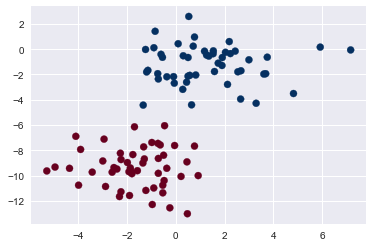
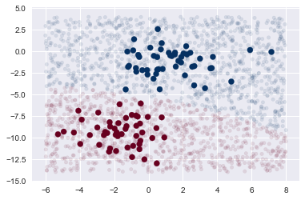

# Naive Bayes Classification

##### 참고 : 파이썬 라이브러를 활용한 머신러닝, 파이썬 데이터 사이언스 핸드북

<br>

> 통계량의 조건부 확률 사이의 관계를 나타내는 방정식인 베이즈 정리를 기반으로 한다. <br>
> 선형 모델과 매우 유사하다. <br>
> 선형 분류기보다 훈련 속가 빠른 편이지만, 일반화 성능이 조금 뒤진다. <br>
> 각 특성을 개별로 취급해 파라미터를 학습하고 각 특성에서 클래스별 통계를 단순하게 취합한다.

##### GaussianNB : 연속적인 데이터
##### BernoulliNB : 이진 데이터 (대부분 텍스트 데이터)
##### MultinomialNB : 카운트 데이터 (대부분 텍스트 데이터)

<br>

```python
import numpy as np
import matplotlib.pyplot as plt
import seaborn as sns; sns.set()
```

<br>

## Gaussian Naive Bayes

##### In
```python
from sklearn.datasets import make_blobs
X, y = make_blobs(100, 2, centers=2, random_state=2, cluster_std=1.5)
plt.scatter(X[:,0], X[:,1], c=y, s=50, cmap='RdBu')
```
##### Out


<br>

##### In
```python
from sklearn.naive_bayes import GaussianNB
model = GaussianNB()
model.fit(X,y)
```
##### Out
    GaussianNB(priors=None)

<br>

##### In
```python
rng = np.random.RandomState(0)
Xnew = [-6, -14] +[14,18] * rng.rand(2000,2)
ynew = model.predict(Xnew)
```

```python
plt.scatter(X[:,0], X[:,1], c=y, s=50, cmap='RdBu')
plt.scatter(Xnew[:,0], Xnew[:,1], c=ynew, s=20, cmap='RdBu', alpha=0.1)
lim = plt.axis()
plt.axis(lim)
```
##### Out
    (-6.799485519755617, 8.79978539770334, -15.092859694486028, 5.093538618048777)


<br>

##### In
```python
yprob = model.predict_proba(Xnew)
yprob[-8:].round(2)
```
##### Out
    array([[0.89, 0.11],
           [1.  , 0.  ],
           [1.  , 0.  ],
           [1.  , 0.  ],
           [1.  , 0.  ],
           [1.  , 0.  ],
           [0.  , 1.  ],
           [0.15, 0.85]])

<br>

## Multinomial Naive Bayes

##### In
```python
from sklearn.datasets import fetch_20newsgroups
data = fetch_20newsgroups()
data.target_names
```
##### Out
    ['alt.atheism',
     'comp.graphics',
     'comp.os.ms-windows.misc',
     'comp.sys.ibm.pc.hardware',
     'comp.sys.mac.hardware',
     'comp.windows.x',
     'misc.forsale',
     'rec.autos',
     'rec.motorcycles',
     'rec.sport.baseball',
     'rec.sport.hockey',
     'sci.crypt',
     'sci.electronics',
     'sci.med',
     'sci.space',
     'soc.religion.christian',
     'talk.politics.guns',
     'talk.politics.mideast',
     'talk.politics.misc',
     'talk.religion.misc']

<br>

##### In
```python
categories = ['talk.religion.misc', 'soc.religion.christian','sci.space','comp.graphics']
train = fetch_20newsgroups(subset='train', categories=categories)
test = fetch_20newsgroups(subset='test', categories=categories)
```

```python
print(train.data[5])
```
##### Out
    From: dmcgee@uluhe.soest.hawaii.edu (Don McGee)
    Subject: Federal Hearing
    Originator: dmcgee@uluhe
    Organization: School of Ocean and Earth Science and Technology
    Distribution: usa
    Lines: 10
    
    
    Fact or rumor....?  Madalyn Murray O'Hare an atheist who eliminated the
    use of the bible reading and prayer in public schools 15 years ago is now
    going to appear before the FCC with a petition to stop the reading of the
    Gospel on the airways of America.  And she is also campaigning to remove
    Christmas programs, songs, etc from the public schools.  If it is true
    then mail to Federal Communications Commission 1919 H Street Washington DC
    20054 expressing your opposition to her request.  Reference Petition number
    
    2493.
    
<br>    

##### In
```python
from sklearn.feature_extraction.text import TfidfVectorizer
from sklearn.naive_bayes import MultinomialNB
from sklearn.pipeline import make_pipeline
model = make_pipeline(TfidfVectorizer(), MultinomialNB())
model.fit(train.data, train.target)
labels = model.predict(test.data)
```

```python
from sklearn.metrics import confusion_matrix
mat = confusion_matrix(test.target, labels)
sns.heatmap(mat.T, square=True, annot=True, fmt='d', cbar=False,
           xticklabels=train.target_names, yticklabels=train.target_names)
plt.xlabel('true label')
plt.ylabel('predicted label')
```
##### Out
    Text(92.68,0.5,'predicted label')


<br>

##### In
```python
def predict_category(s, train=train, model=model):
    pred = model.predict([s])
    return train.target_names[pred[0]]
```

```python
predict_category('sending a payload to the ISS')
```
##### Out
    'sci.space'

<br>

##### In
```python
predict_category('discussing islam vs atheism')
```
##### Out
    'soc.religion.christian'

<br>

##### In
```python
predict_category('determining the screen resolution')
```
##### Out
    'comp.graphics'
