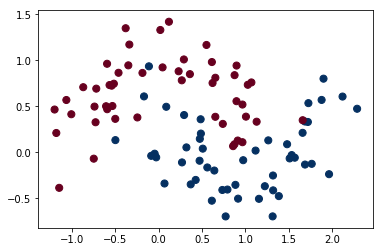
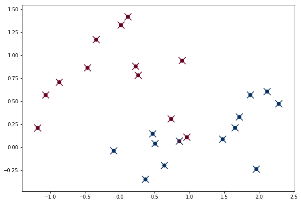

# Random Forest

##### 참고 : 파이썬 라이브러리를 활용한 머신러닝

> 앙상블 기법이다. <br>
> 결정 트리의 단점을 훈련 데이터에 과대적합되는 경향이 있다는 것인데, 랜덤 포레스트는 이 문제를 회피할 수 있다. <br>
> 조금씩 다른 여러 결정 트리의 묶음이다. <br>
> 서로 다른 방향으로 과대적합된 트리를 많이 만들어 평균을 낸다. <br>
> 트리 모델의 예측 성능이 유지되면서 과대적합이 줄어드는 것이 수학적으로 증명되어있다. <br>
> 결정 트리는 각 노드에서 전체 특성을 대상으로 최선의 테스트를 찾는 것이고, 랜덤 포레스트는 각 노드에서 후보 특성을 무작위로 선택한 후 최선의 테스트를 찾는다. <br>

##### 트리를 랜덤하게 만드는 방법
> 트리를 만들 때 사용하는 데이터 포이트를 무작위로 선택하는 방법 <br>
> 분할 테스트에서 특성을 무작위로 선택하는 방법

<br>

### ensemble
> 여러 머신러닝 모델을 연결하여 더 강력한 모델을 만드는 기법 <br>

<br>

### bootstrap sample
> 여러 개의 트리들이 완전히 독립적으로 (각 트리가 고유하게) 만들어지도록 무작위한 선택법 <br>
> n개의 데이터 포인트 중에서 무작위로 데이터를 n_samples 횟수만큼 반복 추출

<br>

### parameter
* n_estimators : 트리 개수
* max_features : 고를 특성의 수
> 값을 크게 하면 트리들이 비슷해지고 가장 두드러진 특성을 이용해 데이터에 잘 맞춰진다. <br>
> 값을 낮게 하면 트리들이 많이 달라지고 각 트리는 데이터에 맞추기 위해 깊이가 깊어지게 된다.
* max_depth
* max_leaf_nodes

<br>

##### 라이브러리 불러오기


```python
import numpy as np
import matplotlib.pyplot as plt
```


```python
from sklearn.datasets import make_moons
from sklearn.model_selection import train_test_split
from sklearn.ensemble import RandomForestClassifier
```

##### 데이터 불러오기

##### In
```python
X, y = make_moons(n_samples=100, noise=0.25, random_state=3)
plt.scatter(X[:,0], X[:, 1], c=y, cmap='RdBu', s=50)
```
##### Out



##### 데이터 나누기


```python
X_train, X_test, y_train, y_test = train_test_split(X, y, stratify=y, random_state=0)
```

##### 모델 훈련

##### In
```python
forest = RandomForestClassifier(n_estimators=5, random_state=2)
forest.fit(X_train, y_train)
```
##### Out
    RandomForestClassifier(bootstrap=True, class_weight=None, criterion='gini',
                max_depth=None, max_features='auto', max_leaf_nodes=None,
                min_impurity_decrease=0.0, min_impurity_split=None,
                min_samples_leaf=1, min_samples_split=2,
                min_weight_fraction_leaf=0.0, n_estimators=5, n_jobs=1,
                oob_score=False, random_state=2, verbose=0, warm_start=False)

<br>

##### 모델 평가

##### In
```python
print('train score : {}'.format(forest.score(X_train, y_train)))
print('test score : {}'.format(forest.score(X_test, y_test)))
```
##### Out
    train score : 0.96
    test score : 0.96
    
<br>

##### In
```python
print('feature importances : {}'.format(forest.feature_importances_))
```
##### Out
    feature importances : [0.42890987 0.57109013]
    
<br>

##### 목표 변수 예측

##### In
```python
pred = forest.predict(X_test)
pred
```
##### Out
    array([1, 1, 0, 0, 0, 1, 0, 1, 1, 1, 1, 0, 0, 1, 1, 0, 1, 0, 0, 0, 0, 0,
           1, 1, 1], dtype=int64)

<br>

##### In
```python
plt.figure(figsize=(10,7))
plt.scatter(X_test[:,0], X_test[:, 1], c=y_test, cmap='RdBu', s=50)
plt.scatter(X_test[:,0], X_test[:, 1], c=pred, cmap='RdBu', s=200, marker='x')
```
##### Out


<br>

## 예제

##### In
```python
from sklearn.datasets import load_breast_cancer
cancer = load_breast_cancer()

X_train, X_test, y_train, y_test = train_test_split(cancer.data, cancer.target, stratify=cancer.target, random_state=0)

for f in range(1,5):
    print('When max features : {}'.format(f))
    
    forest = RandomForestClassifier(n_estimators=50, max_features=f, random_state=0)
    forest.fit(X_train,y_train)
    
    print('train score : {:.2f}'.format(forest.score(X_train,y_train)))
    print('test score : {:.2f}\n'.format(forest.score(X_test,y_test)))
```
##### Out
    When max features : 1
    train score : 1.00
    test score : 0.96
    
    When max features : 2
    train score : 1.00
    test score : 0.95
    
    When max features : 3
    train score : 1.00
    test score : 0.95
    
    When max features : 4
    train score : 1.00
    test score : 0.94
    
<br>

##### In
```python
forest = RandomForestClassifier(n_estimators=50, max_features=1, random_state=0)
forest.fit(X_train,y_train)

print('feature importances : \n{}'.format(forest.feature_importances_))
```
##### Out
    feature importances : 
    [0.04121692 0.02848628 0.07773209 0.04068282 0.01325814 0.02459162
     0.05077512 0.08119805 0.01191943 0.0130864  0.03387308 0.00978743
     0.02160813 0.03012442 0.00668916 0.0148222  0.0270963  0.01826849
     0.01302565 0.01497052 0.05478771 0.03292226 0.07117642 0.05304321
     0.01474895 0.03749848 0.04899831 0.08358389 0.01827081 0.01175772]
    
