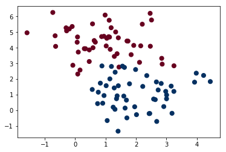
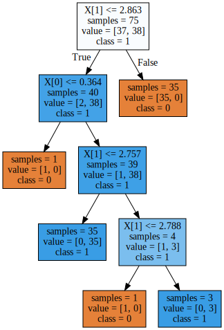
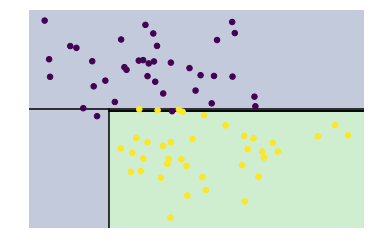
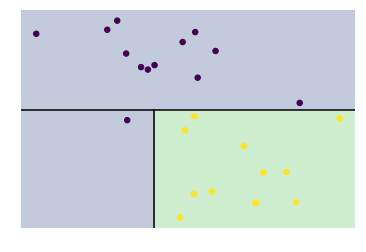
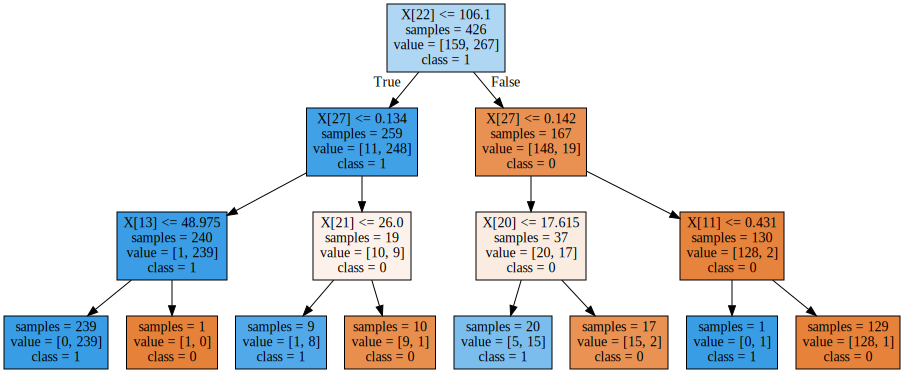

# Decision Tree

##### 참고 : 파이썬 라이브러리를 활용한 머신러닝, 파이썬 데이터 사이언스 핸드북

> ##### 장점
> 분류와 회귀 문제에 널리 사용하는 모델이다. <br>
> 결정에 다다르기 위해 예/아니오 질문을 이어 나가면서 학습한다. <br>
> 만들어진 모델을 쉽게 시각화할 수 있어 비전문가도 이해하기 쉽다. <br>
> 데이터의 스케일에 구애받지 않는다.
> ##### 단점
> 사전 가지치기를 사용함에도 불구하고 과대적합되는 경향이 있다. <br>
> 일반화 성능이 좋지 않다.

<br>

### parameter
* max_depth
* max_features
* max_leaf_nodes

<br>

##### 라이브러리 불러오기


```python
import numpy as np
import matplotlib.pyplot as plt
```


```python
from sklearn.datasets import make_blobs
from sklearn.datasets import load_breast_cancer
from sklearn.model_selection import train_test_split
from sklearn.tree import DecisionTreeClassifier
```

<br>

##### 데이터 불러오기

##### In
```python
X, y = make_blobs(100, 2, centers=2, random_state=0)
plt.scatter(X[:,0], X[:,1], c=y, cmap='RdBu', s=50)
```
##### In


<br>

##### 데이터 나누기


```python
X_train, X_test, y_train, y_test = train_test_split(X, y, random_state=0)
```

<br>

##### 모델 훈련

##### In
```python
tree = DecisionTreeClassifier(random_state=0)
tree.fit(X_train, y_train)
```
##### Out
    DecisionTreeClassifier(class_weight=None, criterion='gini', max_depth=None,
                max_features=None, max_leaf_nodes=None,
                min_impurity_decrease=0.0, min_impurity_split=None,
                min_samples_leaf=1, min_samples_split=2,
                min_weight_fraction_leaf=0.0, presort=False, random_state=0,
                splitter='best')

<br>

##### 모델 평가

##### In
```python
print('trian score : {}'.format(tree.score(X_train, y_train)))
print('test score : {}'.format(tree.score(X_test, y_test)))
```
##### Out
    trian score : 1.0
    test score : 0.96
    
<br>

##### In
```python
print('특성 중요도 : {}'.format(tree.feature_importances_))
```
##### Out
    특성 중요도 : [0.0493763 0.9506237]
    
<br>

##### In
```python
from sklearn.tree import export_graphviz
export_graphviz(tree, out_file='tree_01.dot', class_names=['0','1'], impurity=False, filled=True)
```


```python
import graphviz
with open('tree_01.dot') as f:
    dot_graph = f.read()
display(graphviz.Source(dot_graph))
```
##### Out


<br>

##### In
```python
def visualize_tree(estimator, X, y, boundaries=True, xlim=None, ylim=None, ax=None):
    ax = ax or plt.gca()
    
    # Plot the training points
    ax.scatter(X[:, 0], X[:, 1], c=y, s=30, cmap='viridis', clim=(y.min(), y.max()), zorder=3)
    ax.axis('tight')
    ax.axis('off')
    if xlim is None:
        xlim = ax.get_xlim()
    if ylim is None:
        ylim = ax.get_ylim()
    
    # fit the estimator
    estimator.fit(X, y)
    xx, yy = np.meshgrid(np.linspace(*xlim, num=200), np.linspace(*ylim, num=200))
    Z = estimator.predict(np.c_[xx.ravel(), yy.ravel()])

    # Put the result into a color plot
    n_classes = len(np.unique(y))
    Z = Z.reshape(xx.shape)
    contours = ax.contourf(xx, yy, Z, alpha=0.3, levels=np.arange(n_classes + 1) - 0.5,
                           cmap='viridis', clim=(y.min(), y.max()), zorder=1)

    ax.set(xlim=xlim, ylim=ylim)
    
    # Plot the decision boundaries
    def plot_boundaries(i, xlim, ylim):
        if i >= 0:
            tree = estimator.tree_
        
            if tree.feature[i] == 0:
                ax.plot([tree.threshold[i], tree.threshold[i]], ylim, '-k', zorder=2)
                plot_boundaries(tree.children_left[i], [xlim[0], tree.threshold[i]], ylim)
                plot_boundaries(tree.children_right[i], [tree.threshold[i], xlim[1]], ylim)
        
            elif tree.feature[i] == 1:
                ax.plot(xlim, [tree.threshold[i], tree.threshold[i]], '-k', zorder=2)
                plot_boundaries(tree.children_left[i], xlim, [ylim[0], tree.threshold[i]])
                plot_boundaries(tree.children_right[i], xlim, [tree.threshold[i], ylim[1]])
            
    if boundaries:
        plot_boundaries(0, xlim, ylim)
```


```python
visualize_tree(DecisionTreeClassifier(), X_train, y_train)
```
##### Out


<br>

##### In
```python
visualize_tree(DecisionTreeClassifier(), X_test, y_test)
```
##### Out


<br>

##### 목표 변수 예측

##### In
```python
pred = tree.predict(X_test)
pred
```
##### Out
    array([1, 1, 0, 0, 0, 1, 1, 0, 1, 0, 0, 1, 0, 0, 1, 1, 1, 1, 1, 0, 0, 0,
           0, 1, 1])

<br>

## 예제

##### In
```python
cancer = load_breast_cancer()

X_train, X_test, y_train, y_test = train_test_split(cancer.data, cancer.target, stratify=cancer.target, random_state=0)

for d in range(1,11):
    print('When max depth : {}'.format(d))
    
    tree = DecisionTreeClassifier(max_depth=d, random_state=0)
    tree.fit(X_train,y_train)
    
    print('train score : {:.2f}'.format(tree.score(X_train,y_train)))
    print('test score : {:.2f}\n'.format(tree.score(X_test,y_test)))
```
##### Out
    When max depth : 1
    train score : 0.93
    test score : 0.89
    
    When max depth : 2
    train score : 0.93
    test score : 0.89
    
    When max depth : 3
    train score : 0.98
    test score : 0.92
    
    When max depth : 4
    train score : 0.99
    test score : 0.91
    
    When max depth : 5
    train score : 1.00
    test score : 0.90
    
    When max depth : 6
    train score : 1.00
    test score : 0.90
    
    When max depth : 7
    train score : 1.00
    test score : 0.90
    
    When max depth : 8
    train score : 1.00
    test score : 0.90
    
    When max depth : 9
    train score : 1.00
    test score : 0.90
    
    When max depth : 10
    train score : 1.00
    test score : 0.90
    
<br>    

##### In
```python
tree = DecisionTreeClassifier(max_depth=3, random_state=0)
tree.fit(X_train,y_train)

print('특성 중요도 : {}'.format(tree.feature_importances_))
```
##### Out
    특성 중요도 : [0.         0.         0.         0.         0.         0.
     0.         0.         0.         0.         0.         0.01069388
     0.         0.01090021 0.         0.         0.         0.
     0.         0.         0.04022023 0.03226776 0.79120523 0.
     0.         0.         0.         0.11471269 0.         0.        ]
    
<br>

##### In
```python
from sklearn.tree import export_graphviz
export_graphviz(tree, out_file='tree_02.dot', class_names=['0','1'], impurity=False, filled=True)
```


```python
import graphviz
with open('tree_02.dot') as f:
    dot_graph = f.read()
display(graphviz.Source(dot_graph))
```
##### Out


