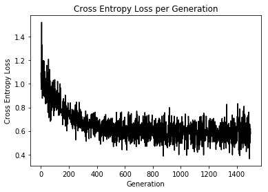
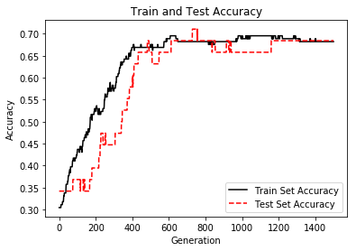

# TensorFlow

##### 참고 : TensorFlow Machine Learning Cookbook


```python
import tensorflow as tf
sess = tf.Session()
```

```python
import numpy as np
import matplotlib.pyplot as plt
```

<br>

### 로지스틱 회귀 구현
> 선형 회귀를 이진 분류를 바꾸는 방법이다. <br>
> 선형 회귀 결과 값을 시그모이드 함수에 넣어 0과 1 사이의 값으로 출력하여 분류한다.

<br>

##### 데이터 로드

##### In
```python
# 데이터 로드
import requests
import os.path
import csv

birthdata_url = 'https://github.com/nfmcclure/tensorflow_cookbook/raw/master/01_Introduction/07_Working_with_Data_Sources/birthweight_data/birthweight.dat'
birth_file = requests.get(birthdata_url)
birth_data = birth_file.text.split('\r\n')
birth_data
```
##### Out
    ['LOW\tAGE\tLWT\tRACE\tSMOKE\tPTL\tHT\tUI\tBWT',
     '1\t28\t113\t1\t1\t1\t0\t1\t709',
     '1\t29\t130\t0\t0\t0\t0\t1\t1021',
     '1\t34\t187\t1\t1\t0\t1\t0\t1135',
     '1\t25\t105\t1\t0\t1\t1\t0\t1330',
     '1\t25\t85\t1\t0\t0\t0\t1\t1474',
     '1\t27\t150\t1\t0\t0\t0\t0\t1588',
     '1\t23\t97\t1\t0\t0\t0\t1\t1588',
     '1\t24\t128\t1\t0\t1\t0\t0\t1701',
     '1\t24\t132\t1\t0\t0\t1\t0\t1729',
     '1\t21\t165\t0\t1\t0\t1\t0\t1790',
     '1\t32\t105\t1\t1\t0\t0\t0\t1818',
     '1\t19\t91\t0\t1\t1\t0\t1\t1885',
     '1\t25\t115\t1\t0\t0\t0\t0\t1893',
     '1\t16\t130\t1\t0\t0\t0\t0\t1899',
     '1\t25\t92\t0\t1\t0\t0\t0\t1928',
     '1\t20\t150\t0\t1\t0\t0\t0\t1928',
     '1\t21\t190\t1\t0\t0\t0\t1\t1928',
     '1\t24\t155\t0\t1\t1\t0\t0\t1936',
     '1\t21\t103\t1\t0\t0\t0\t0\t1970',
     '1\t20\t125\t1\t0\t0\t0\t1\t2055',
     '1\t25\t89\t1\t0\t1\t0\t0\t2055',
     '1\t19\t102\t0\t0\t0\t0\t0\t2082',
     '1\t19\t112\t0\t1\t0\t0\t1\t2084',
     '1\t26\t117\t0\t1\t1\t0\t1\t2084',
     '1\t24\t138\t0\t0\t0\t0\t0\t2100',
     '1\t17\t130\t1\t1\t1\t0\t1\t2125',
     '1\t20\t120\t1\t1\t0\t0\t0\t2126',
     '1\t22\t130\t0\t1\t1\t0\t1\t2187',
     '1\t27\t130\t1\t0\t0\t0\t1\t2187',
     '1\t20\t80\t1\t1\t0\t0\t1\t2211',
     '1\t17\t110\t0\t1\t0\t0\t0\t2225',
     '1\t25\t105\t1\t0\t1\t0\t0\t2240',
     '1\t20\t109\t1\t0\t0\t0\t0\t2240',
     '1\t18\t148\t1\t0\t0\t0\t0\t2282',
     '1\t18\t110\t1\t1\t1\t0\t0\t2296',
     '1\t20\t121\t0\t1\t1\t0\t1\t2296',
     '1\t21\t100\t1\t0\t1\t0\t0\t2301',
     '1\t26\t96\t1\t0\t0\t0\t0\t2325',
     '1\t31\t102\t0\t1\t1\t0\t0\t2353',
     '1\t15\t110\t0\t0\t0\t0\t0\t2353',
     '1\t23\t187\t1\t1\t0\t0\t0\t2367',
     '1\t20\t122\t1\t1\t1\t0\t0\t2381',
     '1\t24\t105\t1\t1\t0\t0\t0\t2381',
     '1\t15\t115\t1\t0\t0\t0\t1\t2381',
     '1\t23\t120\t1\t0\t0\t0\t0\t2395',
     '1\t30\t142\t0\t1\t1\t0\t0\t2410',
     '1\t22\t130\t0\t1\t0\t0\t0\t2410',
     '1\t17\t120\t0\t1\t0\t0\t0\t2414',
     '1\t23\t110\t0\t1\t1\t0\t0\t2424',
     '1\t17\t120\t1\t0\t0\t0\t0\t2438',
     '1\t26\t154\t1\t0\t1\t1\t0\t2442',
     '1\t20\t105\t1\t0\t0\t0\t0\t2450',
     '1\t26\t168\t0\t1\t0\t0\t0\t2466',
     '1\t14\t101\t1\t1\t1\t0\t0\t2466',
     '1\t28\t95\t0\t1\t0\t0\t0\t2466',
     '1\t14\t100\t1\t0\t0\t0\t0\t2495',
     '1\t23\t94\t1\t1\t0\t0\t0\t2495',
     '1\t17\t142\t1\t0\t0\t1\t0\t2495',
     '1\t21\t130\t0\t1\t0\t1\t0\t2495',
     '0\t19\t182\t1\t0\t0\t0\t1\t2523',
     '0\t33\t155\t1\t0\t0\t0\t0\t2551',
     '0\t20\t105\t0\t1\t0\t0\t0\t2557',
     '0\t21\t108\t0\t1\t0\t0\t1\t2594',
     '0\t18\t107\t0\t1\t0\t0\t1\t2600',
     '0\t21\t124\t1\t0\t0\t0\t0\t2622',
     '0\t22\t118\t0\t0\t0\t0\t0\t2637',
     '0\t17\t103\t1\t0\t0\t0\t0\t2637',
     '0\t29\t123\t0\t1\t0\t0\t0\t2663',
     '0\t26\t113\t0\t1\t0\t0\t0\t2665',
     '0\t19\t95\t1\t0\t0\t0\t0\t2722',
     '0\t19\t150\t1\t0\t0\t0\t0\t2733',
     '0\t22\t95\t1\t0\t0\t1\t0\t2750',
     '0\t30\t107\t1\t0\t1\t0\t1\t2750',
     '0\t18\t100\t0\t1\t0\t0\t0\t2769',
     '0\t18\t100\t1\t1\t0\t0\t0\t2769',
     '0\t15\t98\t1\t0\t0\t0\t0\t2778',
     '0\t25\t118\t0\t1\t0\t0\t0\t2782',
     '0\t20\t120\t1\t0\t0\t0\t1\t2807',
     '0\t28\t120\t0\t1\t0\t0\t0\t2821',
     '0\t32\t121\t1\t0\t0\t0\t0\t2835',
     '0\t31\t100\t0\t0\t0\t0\t1\t2835',
     '0\t36\t202\t0\t0\t0\t0\t0\t2836',
     '0\t28\t120\t1\t0\t0\t0\t0\t2863',
     '0\t25\t120\t1\t0\t0\t0\t1\t2877',
     '0\t28\t167\t0\t0\t0\t0\t0\t2877',
     '0\t17\t122\t0\t1\t0\t0\t0\t2906',
     '0\t29\t150\t0\t0\t0\t0\t0\t2920',
     '0\t26\t168\t1\t1\t0\t0\t0\t2920',
     '0\t17\t113\t1\t0\t0\t0\t0\t2920',
     '0\t17\t113\t1\t0\t0\t0\t0\t2920',
     '0\t24\t90\t0\t1\t1\t0\t0\t2948',
     '0\t35\t121\t1\t1\t1\t1\t0\t2948',
     '0\t25\t155\t0\t1\t1\t0\t0\t2977',
     '0\t25\t125\t1\t0\t0\t0\t0\t2977',
     '0\t29\t140\t0\t1\t0\t0\t0\t2977',
     '0\t19\t138\t0\t1\t0\t1\t0\t2977',
     '0\t27\t124\t0\t1\t0\t0\t0\t2992',
     '0\t31\t115\t0\t1\t0\t0\t0\t3005',
     '0\t33\t109\t0\t1\t0\t0\t0\t3033',
     '0\t21\t185\t1\t1\t0\t0\t0\t3042',
     '0\t19\t189\t0\t0\t0\t0\t0\t3062',
     '0\t23\t130\t1\t0\t0\t0\t0\t3062',
     '0\t21\t160\t0\t0\t0\t0\t0\t3062',
     '0\t18\t90\t0\t1\t0\t0\t1\t3076',
     '0\t18\t90\t0\t1\t0\t0\t1\t3076',
     '0\t32\t132\t0\t0\t0\t0\t0\t3080',
     '0\t19\t132\t1\t0\t0\t0\t0\t3090',
     '0\t24\t115\t0\t0\t0\t0\t0\t3090',
     '0\t22\t85\t1\t1\t0\t0\t0\t3090',
     '0\t22\t120\t0\t0\t0\t1\t0\t3100',
     '0\t23\t128\t1\t0\t0\t0\t0\t3104',
     '0\t22\t130\t0\t1\t0\t0\t0\t3132',
     '0\t30\t95\t0\t1\t0\t0\t0\t3147',
     '0\t19\t115\t1\t0\t0\t0\t0\t3175',
     '0\t16\t110\t1\t0\t0\t0\t0\t3175',
     '0\t21\t110\t1\t1\t0\t0\t1\t3203',
     '0\t30\t153\t1\t0\t0\t0\t0\t3203',
     '0\t20\t103\t1\t0\t0\t0\t0\t3203',
     '0\t17\t119\t1\t0\t0\t0\t0\t3225',
     '0\t17\t119\t1\t0\t0\t0\t0\t3225',
     '0\t23\t119\t1\t0\t0\t0\t0\t3232',
     '0\t24\t110\t1\t0\t0\t0\t0\t3232',
     '0\t28\t140\t0\t0\t0\t0\t0\t3234',
     '0\t26\t133\t1\t1\t0\t0\t0\t3260',
     '0\t20\t169\t1\t0\t1\t0\t1\t3274',
     '0\t24\t115\t1\t0\t0\t0\t0\t3274',
     '0\t28\t250\t1\t1\t0\t0\t0\t3303',
     '0\t20\t141\t0\t0\t0\t0\t1\t3317',
     '0\t22\t158\t1\t0\t1\t0\t0\t3317',
     '0\t22\t112\t0\t1\t1\t0\t0\t3317',
     '0\t31\t150\t1\t1\t0\t0\t0\t3321',
     '0\t23\t115\t1\t1\t0\t0\t0\t3331',
     '0\t16\t112\t1\t0\t0\t0\t0\t3374',
     '0\t16\t135\t0\t1\t0\t0\t0\t3374',
     '0\t18\t229\t1\t0\t0\t0\t0\t3402',
     '0\t25\t140\t0\t0\t0\t0\t0\t3416',
     '0\t32\t134\t0\t1\t1\t0\t0\t3430',
     '0\t20\t121\t1\t1\t0\t0\t0\t3444',
     '0\t23\t190\t0\t0\t0\t0\t0\t3459',
     '0\t22\t131\t0\t0\t0\t0\t0\t3460',
     '0\t32\t170\t0\t0\t0\t0\t0\t3473',
     '0\t30\t110\t1\t0\t0\t0\t0\t3475',
     '0\t20\t127\t1\t0\t0\t0\t0\t3487',
     '0\t23\t123\t1\t0\t0\t0\t0\t3544',
     '0\t17\t120\t1\t1\t0\t0\t0\t3572',
     '0\t19\t105\t1\t0\t0\t0\t0\t3572',
     '0\t23\t130\t0\t0\t0\t0\t0\t3586',
     '0\t36\t175\t0\t0\t0\t0\t0\t3600',
     '0\t22\t125\t0\t0\t0\t0\t0\t3614',
     '0\t24\t133\t0\t0\t0\t0\t0\t3614',
     '0\t21\t134\t1\t0\t0\t0\t0\t3629',
     '0\t19\t235\t0\t1\t0\t1\t0\t3629',
     '0\t25\t200\t0\t0\t1\t0\t1\t3637',
     '0\t16\t135\t0\t1\t0\t0\t0\t3643',
     '0\t29\t135\t0\t0\t0\t0\t0\t3651',
     '0\t29\t154\t0\t0\t0\t0\t0\t3651',
     '0\t19\t147\t0\t1\t0\t0\t0\t3651',
     '0\t19\t147\t0\t1\t0\t0\t0\t3651',
     '0\t30\t137\t0\t0\t0\t0\t0\t3699',
     '0\t24\t110\t0\t0\t0\t0\t0\t3728',
     '0\t19\t184\t0\t1\t0\t1\t0\t3756',
     '0\t24\t110\t0\t0\t1\t0\t0\t3770',
     '0\t23\t110\t0\t0\t0\t0\t0\t3770',
     '0\t20\t120\t1\t0\t0\t0\t0\t3770',
     '0\t25\t141\t0\t0\t0\t1\t0\t3790',
     '0\t30\t112\t0\t0\t0\t0\t0\t3799',
     '0\t22\t169\t0\t0\t0\t0\t0\t3827',
     '0\t18\t120\t0\t1\t0\t0\t0\t3856',
     '0\t16\t170\t1\t0\t0\t0\t0\t3860',
     '0\t32\t186\t0\t0\t0\t0\t0\t3860',
     '0\t18\t120\t1\t0\t0\t0\t0\t3884',
     '0\t29\t130\t0\t1\t0\t0\t0\t3884',
     '0\t33\t117\t0\t0\t0\t0\t1\t3912',
     '0\t20\t170\t0\t1\t0\t0\t0\t3940',
     '0\t28\t134\t1\t0\t0\t0\t0\t3941',
     '0\t14\t135\t0\t0\t1\t0\t0\t3941',
     '0\t28\t130\t1\t0\t0\t0\t0\t3969',
     '0\t25\t120\t0\t0\t0\t0\t0\t3983',
     '0\t16\t135\t1\t0\t0\t0\t0\t3997',
     '0\t20\t158\t0\t0\t0\t0\t0\t3997',
     '0\t26\t160\t0\t0\t0\t0\t0\t4054',
     '0\t21\t115\t0\t0\t0\t0\t0\t4054',
     '0\t22\t129\t0\t0\t0\t0\t0\t4111',
     '0\t25\t130\t0\t0\t0\t0\t0\t4153',
     '0\t31\t120\t0\t0\t0\t0\t0\t4167',
     '0\t35\t170\t0\t0\t1\t0\t0\t4174',
     '0\t19\t120\t0\t1\t0\t1\t0\t4238',
     '0\t24\t216\t0\t0\t0\t0\t0\t4593',
     '0\t45\t123\t0\t0\t1\t0\t0\t4990',
     '',
     '']

<br>

##### In
```python
birth_header = birth_data[0].split('\t')
birth_header
```
##### Out
    ['LOW', 'AGE', 'LWT', 'RACE', 'SMOKE', 'PTL', 'HT', 'UI', 'BWT']

<br>

##### In
```python
birth_data = [[float(x) for x in y.split('\t') if len(x) >= 1] for y in birth_data[1:] if len(y) >= 1]
birth_data
```
##### Out
    [[1.0, 28.0, 113.0, 1.0, 1.0, 1.0, 0.0, 1.0, 709.0],
     [1.0, 29.0, 130.0, 0.0, 0.0, 0.0, 0.0, 1.0, 1021.0],
     [1.0, 34.0, 187.0, 1.0, 1.0, 0.0, 1.0, 0.0, 1135.0],
     [1.0, 25.0, 105.0, 1.0, 0.0, 1.0, 1.0, 0.0, 1330.0],
     [1.0, 25.0, 85.0, 1.0, 0.0, 0.0, 0.0, 1.0, 1474.0],
     [1.0, 27.0, 150.0, 1.0, 0.0, 0.0, 0.0, 0.0, 1588.0],
     [1.0, 23.0, 97.0, 1.0, 0.0, 0.0, 0.0, 1.0, 1588.0],
     [1.0, 24.0, 128.0, 1.0, 0.0, 1.0, 0.0, 0.0, 1701.0],
     [1.0, 24.0, 132.0, 1.0, 0.0, 0.0, 1.0, 0.0, 1729.0],
     [1.0, 21.0, 165.0, 0.0, 1.0, 0.0, 1.0, 0.0, 1790.0],
     [1.0, 32.0, 105.0, 1.0, 1.0, 0.0, 0.0, 0.0, 1818.0],
     [1.0, 19.0, 91.0, 0.0, 1.0, 1.0, 0.0, 1.0, 1885.0],
     [1.0, 25.0, 115.0, 1.0, 0.0, 0.0, 0.0, 0.0, 1893.0],
     [1.0, 16.0, 130.0, 1.0, 0.0, 0.0, 0.0, 0.0, 1899.0],
     [1.0, 25.0, 92.0, 0.0, 1.0, 0.0, 0.0, 0.0, 1928.0],
     [1.0, 20.0, 150.0, 0.0, 1.0, 0.0, 0.0, 0.0, 1928.0],
     [1.0, 21.0, 190.0, 1.0, 0.0, 0.0, 0.0, 1.0, 1928.0],
     [1.0, 24.0, 155.0, 0.0, 1.0, 1.0, 0.0, 0.0, 1936.0],
     [1.0, 21.0, 103.0, 1.0, 0.0, 0.0, 0.0, 0.0, 1970.0],
     [1.0, 20.0, 125.0, 1.0, 0.0, 0.0, 0.0, 1.0, 2055.0],
     [1.0, 25.0, 89.0, 1.0, 0.0, 1.0, 0.0, 0.0, 2055.0],
     [1.0, 19.0, 102.0, 0.0, 0.0, 0.0, 0.0, 0.0, 2082.0],
     [1.0, 19.0, 112.0, 0.0, 1.0, 0.0, 0.0, 1.0, 2084.0],
     [1.0, 26.0, 117.0, 0.0, 1.0, 1.0, 0.0, 1.0, 2084.0],
     [1.0, 24.0, 138.0, 0.0, 0.0, 0.0, 0.0, 0.0, 2100.0],
     [1.0, 17.0, 130.0, 1.0, 1.0, 1.0, 0.0, 1.0, 2125.0],
     [1.0, 20.0, 120.0, 1.0, 1.0, 0.0, 0.0, 0.0, 2126.0],
     [1.0, 22.0, 130.0, 0.0, 1.0, 1.0, 0.0, 1.0, 2187.0],
     [1.0, 27.0, 130.0, 1.0, 0.0, 0.0, 0.0, 1.0, 2187.0],
     [1.0, 20.0, 80.0, 1.0, 1.0, 0.0, 0.0, 1.0, 2211.0],
     [1.0, 17.0, 110.0, 0.0, 1.0, 0.0, 0.0, 0.0, 2225.0],
     [1.0, 25.0, 105.0, 1.0, 0.0, 1.0, 0.0, 0.0, 2240.0],
     [1.0, 20.0, 109.0, 1.0, 0.0, 0.0, 0.0, 0.0, 2240.0],
     [1.0, 18.0, 148.0, 1.0, 0.0, 0.0, 0.0, 0.0, 2282.0],
     [1.0, 18.0, 110.0, 1.0, 1.0, 1.0, 0.0, 0.0, 2296.0],
     [1.0, 20.0, 121.0, 0.0, 1.0, 1.0, 0.0, 1.0, 2296.0],
     [1.0, 21.0, 100.0, 1.0, 0.0, 1.0, 0.0, 0.0, 2301.0],
     [1.0, 26.0, 96.0, 1.0, 0.0, 0.0, 0.0, 0.0, 2325.0],
     [1.0, 31.0, 102.0, 0.0, 1.0, 1.0, 0.0, 0.0, 2353.0],
     [1.0, 15.0, 110.0, 0.0, 0.0, 0.0, 0.0, 0.0, 2353.0],
     [1.0, 23.0, 187.0, 1.0, 1.0, 0.0, 0.0, 0.0, 2367.0],
     [1.0, 20.0, 122.0, 1.0, 1.0, 1.0, 0.0, 0.0, 2381.0],
     [1.0, 24.0, 105.0, 1.0, 1.0, 0.0, 0.0, 0.0, 2381.0],
     [1.0, 15.0, 115.0, 1.0, 0.0, 0.0, 0.0, 1.0, 2381.0],
     [1.0, 23.0, 120.0, 1.0, 0.0, 0.0, 0.0, 0.0, 2395.0],
     [1.0, 30.0, 142.0, 0.0, 1.0, 1.0, 0.0, 0.0, 2410.0],
     [1.0, 22.0, 130.0, 0.0, 1.0, 0.0, 0.0, 0.0, 2410.0],
     [1.0, 17.0, 120.0, 0.0, 1.0, 0.0, 0.0, 0.0, 2414.0],
     [1.0, 23.0, 110.0, 0.0, 1.0, 1.0, 0.0, 0.0, 2424.0],
     [1.0, 17.0, 120.0, 1.0, 0.0, 0.0, 0.0, 0.0, 2438.0],
     [1.0, 26.0, 154.0, 1.0, 0.0, 1.0, 1.0, 0.0, 2442.0],
     [1.0, 20.0, 105.0, 1.0, 0.0, 0.0, 0.0, 0.0, 2450.0],
     [1.0, 26.0, 168.0, 0.0, 1.0, 0.0, 0.0, 0.0, 2466.0],
     [1.0, 14.0, 101.0, 1.0, 1.0, 1.0, 0.0, 0.0, 2466.0],
     [1.0, 28.0, 95.0, 0.0, 1.0, 0.0, 0.0, 0.0, 2466.0],
     [1.0, 14.0, 100.0, 1.0, 0.0, 0.0, 0.0, 0.0, 2495.0],
     [1.0, 23.0, 94.0, 1.0, 1.0, 0.0, 0.0, 0.0, 2495.0],
     [1.0, 17.0, 142.0, 1.0, 0.0, 0.0, 1.0, 0.0, 2495.0],
     [1.0, 21.0, 130.0, 0.0, 1.0, 0.0, 1.0, 0.0, 2495.0],
     [0.0, 19.0, 182.0, 1.0, 0.0, 0.0, 0.0, 1.0, 2523.0],
     [0.0, 33.0, 155.0, 1.0, 0.0, 0.0, 0.0, 0.0, 2551.0],
     [0.0, 20.0, 105.0, 0.0, 1.0, 0.0, 0.0, 0.0, 2557.0],
     [0.0, 21.0, 108.0, 0.0, 1.0, 0.0, 0.0, 1.0, 2594.0],
     [0.0, 18.0, 107.0, 0.0, 1.0, 0.0, 0.0, 1.0, 2600.0],
     [0.0, 21.0, 124.0, 1.0, 0.0, 0.0, 0.0, 0.0, 2622.0],
     [0.0, 22.0, 118.0, 0.0, 0.0, 0.0, 0.0, 0.0, 2637.0],
     [0.0, 17.0, 103.0, 1.0, 0.0, 0.0, 0.0, 0.0, 2637.0],
     [0.0, 29.0, 123.0, 0.0, 1.0, 0.0, 0.0, 0.0, 2663.0],
     [0.0, 26.0, 113.0, 0.0, 1.0, 0.0, 0.0, 0.0, 2665.0],
     [0.0, 19.0, 95.0, 1.0, 0.0, 0.0, 0.0, 0.0, 2722.0],
     [0.0, 19.0, 150.0, 1.0, 0.0, 0.0, 0.0, 0.0, 2733.0],
     [0.0, 22.0, 95.0, 1.0, 0.0, 0.0, 1.0, 0.0, 2750.0],
     [0.0, 30.0, 107.0, 1.0, 0.0, 1.0, 0.0, 1.0, 2750.0],
     [0.0, 18.0, 100.0, 0.0, 1.0, 0.0, 0.0, 0.0, 2769.0],
     [0.0, 18.0, 100.0, 1.0, 1.0, 0.0, 0.0, 0.0, 2769.0],
     [0.0, 15.0, 98.0, 1.0, 0.0, 0.0, 0.0, 0.0, 2778.0],
     [0.0, 25.0, 118.0, 0.0, 1.0, 0.0, 0.0, 0.0, 2782.0],
     [0.0, 20.0, 120.0, 1.0, 0.0, 0.0, 0.0, 1.0, 2807.0],
     [0.0, 28.0, 120.0, 0.0, 1.0, 0.0, 0.0, 0.0, 2821.0],
     [0.0, 32.0, 121.0, 1.0, 0.0, 0.0, 0.0, 0.0, 2835.0],
     [0.0, 31.0, 100.0, 0.0, 0.0, 0.0, 0.0, 1.0, 2835.0],
     [0.0, 36.0, 202.0, 0.0, 0.0, 0.0, 0.0, 0.0, 2836.0],
     [0.0, 28.0, 120.0, 1.0, 0.0, 0.0, 0.0, 0.0, 2863.0],
     [0.0, 25.0, 120.0, 1.0, 0.0, 0.0, 0.0, 1.0, 2877.0],
     [0.0, 28.0, 167.0, 0.0, 0.0, 0.0, 0.0, 0.0, 2877.0],
     [0.0, 17.0, 122.0, 0.0, 1.0, 0.0, 0.0, 0.0, 2906.0],
     [0.0, 29.0, 150.0, 0.0, 0.0, 0.0, 0.0, 0.0, 2920.0],
     [0.0, 26.0, 168.0, 1.0, 1.0, 0.0, 0.0, 0.0, 2920.0],
     [0.0, 17.0, 113.0, 1.0, 0.0, 0.0, 0.0, 0.0, 2920.0],
     [0.0, 17.0, 113.0, 1.0, 0.0, 0.0, 0.0, 0.0, 2920.0],
     [0.0, 24.0, 90.0, 0.0, 1.0, 1.0, 0.0, 0.0, 2948.0],
     [0.0, 35.0, 121.0, 1.0, 1.0, 1.0, 1.0, 0.0, 2948.0],
     [0.0, 25.0, 155.0, 0.0, 1.0, 1.0, 0.0, 0.0, 2977.0],
     [0.0, 25.0, 125.0, 1.0, 0.0, 0.0, 0.0, 0.0, 2977.0],
     [0.0, 29.0, 140.0, 0.0, 1.0, 0.0, 0.0, 0.0, 2977.0],
     [0.0, 19.0, 138.0, 0.0, 1.0, 0.0, 1.0, 0.0, 2977.0],
     [0.0, 27.0, 124.0, 0.0, 1.0, 0.0, 0.0, 0.0, 2992.0],
     [0.0, 31.0, 115.0, 0.0, 1.0, 0.0, 0.0, 0.0, 3005.0],
     [0.0, 33.0, 109.0, 0.0, 1.0, 0.0, 0.0, 0.0, 3033.0],
     [0.0, 21.0, 185.0, 1.0, 1.0, 0.0, 0.0, 0.0, 3042.0],
     [0.0, 19.0, 189.0, 0.0, 0.0, 0.0, 0.0, 0.0, 3062.0],
     [0.0, 23.0, 130.0, 1.0, 0.0, 0.0, 0.0, 0.0, 3062.0],
     [0.0, 21.0, 160.0, 0.0, 0.0, 0.0, 0.0, 0.0, 3062.0],
     [0.0, 18.0, 90.0, 0.0, 1.0, 0.0, 0.0, 1.0, 3076.0],
     [0.0, 18.0, 90.0, 0.0, 1.0, 0.0, 0.0, 1.0, 3076.0],
     [0.0, 32.0, 132.0, 0.0, 0.0, 0.0, 0.0, 0.0, 3080.0],
     [0.0, 19.0, 132.0, 1.0, 0.0, 0.0, 0.0, 0.0, 3090.0],
     [0.0, 24.0, 115.0, 0.0, 0.0, 0.0, 0.0, 0.0, 3090.0],
     [0.0, 22.0, 85.0, 1.0, 1.0, 0.0, 0.0, 0.0, 3090.0],
     [0.0, 22.0, 120.0, 0.0, 0.0, 0.0, 1.0, 0.0, 3100.0],
     [0.0, 23.0, 128.0, 1.0, 0.0, 0.0, 0.0, 0.0, 3104.0],
     [0.0, 22.0, 130.0, 0.0, 1.0, 0.0, 0.0, 0.0, 3132.0],
     [0.0, 30.0, 95.0, 0.0, 1.0, 0.0, 0.0, 0.0, 3147.0],
     [0.0, 19.0, 115.0, 1.0, 0.0, 0.0, 0.0, 0.0, 3175.0],
     [0.0, 16.0, 110.0, 1.0, 0.0, 0.0, 0.0, 0.0, 3175.0],
     [0.0, 21.0, 110.0, 1.0, 1.0, 0.0, 0.0, 1.0, 3203.0],
     [0.0, 30.0, 153.0, 1.0, 0.0, 0.0, 0.0, 0.0, 3203.0],
     [0.0, 20.0, 103.0, 1.0, 0.0, 0.0, 0.0, 0.0, 3203.0],
     [0.0, 17.0, 119.0, 1.0, 0.0, 0.0, 0.0, 0.0, 3225.0],
     [0.0, 17.0, 119.0, 1.0, 0.0, 0.0, 0.0, 0.0, 3225.0],
     [0.0, 23.0, 119.0, 1.0, 0.0, 0.0, 0.0, 0.0, 3232.0],
     [0.0, 24.0, 110.0, 1.0, 0.0, 0.0, 0.0, 0.0, 3232.0],
     [0.0, 28.0, 140.0, 0.0, 0.0, 0.0, 0.0, 0.0, 3234.0],
     [0.0, 26.0, 133.0, 1.0, 1.0, 0.0, 0.0, 0.0, 3260.0],
     [0.0, 20.0, 169.0, 1.0, 0.0, 1.0, 0.0, 1.0, 3274.0],
     [0.0, 24.0, 115.0, 1.0, 0.0, 0.0, 0.0, 0.0, 3274.0],
     [0.0, 28.0, 250.0, 1.0, 1.0, 0.0, 0.0, 0.0, 3303.0],
     [0.0, 20.0, 141.0, 0.0, 0.0, 0.0, 0.0, 1.0, 3317.0],
     [0.0, 22.0, 158.0, 1.0, 0.0, 1.0, 0.0, 0.0, 3317.0],
     [0.0, 22.0, 112.0, 0.0, 1.0, 1.0, 0.0, 0.0, 3317.0],
     [0.0, 31.0, 150.0, 1.0, 1.0, 0.0, 0.0, 0.0, 3321.0],
     [0.0, 23.0, 115.0, 1.0, 1.0, 0.0, 0.0, 0.0, 3331.0],
     [0.0, 16.0, 112.0, 1.0, 0.0, 0.0, 0.0, 0.0, 3374.0],
     [0.0, 16.0, 135.0, 0.0, 1.0, 0.0, 0.0, 0.0, 3374.0],
     [0.0, 18.0, 229.0, 1.0, 0.0, 0.0, 0.0, 0.0, 3402.0],
     [0.0, 25.0, 140.0, 0.0, 0.0, 0.0, 0.0, 0.0, 3416.0],
     [0.0, 32.0, 134.0, 0.0, 1.0, 1.0, 0.0, 0.0, 3430.0],
     [0.0, 20.0, 121.0, 1.0, 1.0, 0.0, 0.0, 0.0, 3444.0],
     [0.0, 23.0, 190.0, 0.0, 0.0, 0.0, 0.0, 0.0, 3459.0],
     [0.0, 22.0, 131.0, 0.0, 0.0, 0.0, 0.0, 0.0, 3460.0],
     [0.0, 32.0, 170.0, 0.0, 0.0, 0.0, 0.0, 0.0, 3473.0],
     [0.0, 30.0, 110.0, 1.0, 0.0, 0.0, 0.0, 0.0, 3475.0],
     [0.0, 20.0, 127.0, 1.0, 0.0, 0.0, 0.0, 0.0, 3487.0],
     [0.0, 23.0, 123.0, 1.0, 0.0, 0.0, 0.0, 0.0, 3544.0],
     [0.0, 17.0, 120.0, 1.0, 1.0, 0.0, 0.0, 0.0, 3572.0],
     [0.0, 19.0, 105.0, 1.0, 0.0, 0.0, 0.0, 0.0, 3572.0],
     [0.0, 23.0, 130.0, 0.0, 0.0, 0.0, 0.0, 0.0, 3586.0],
     [0.0, 36.0, 175.0, 0.0, 0.0, 0.0, 0.0, 0.0, 3600.0],
     [0.0, 22.0, 125.0, 0.0, 0.0, 0.0, 0.0, 0.0, 3614.0],
     [0.0, 24.0, 133.0, 0.0, 0.0, 0.0, 0.0, 0.0, 3614.0],
     [0.0, 21.0, 134.0, 1.0, 0.0, 0.0, 0.0, 0.0, 3629.0],
     [0.0, 19.0, 235.0, 0.0, 1.0, 0.0, 1.0, 0.0, 3629.0],
     [0.0, 25.0, 200.0, 0.0, 0.0, 1.0, 0.0, 1.0, 3637.0],
     [0.0, 16.0, 135.0, 0.0, 1.0, 0.0, 0.0, 0.0, 3643.0],
     [0.0, 29.0, 135.0, 0.0, 0.0, 0.0, 0.0, 0.0, 3651.0],
     [0.0, 29.0, 154.0, 0.0, 0.0, 0.0, 0.0, 0.0, 3651.0],
     [0.0, 19.0, 147.0, 0.0, 1.0, 0.0, 0.0, 0.0, 3651.0],
     [0.0, 19.0, 147.0, 0.0, 1.0, 0.0, 0.0, 0.0, 3651.0],
     [0.0, 30.0, 137.0, 0.0, 0.0, 0.0, 0.0, 0.0, 3699.0],
     [0.0, 24.0, 110.0, 0.0, 0.0, 0.0, 0.0, 0.0, 3728.0],
     [0.0, 19.0, 184.0, 0.0, 1.0, 0.0, 1.0, 0.0, 3756.0],
     [0.0, 24.0, 110.0, 0.0, 0.0, 1.0, 0.0, 0.0, 3770.0],
     [0.0, 23.0, 110.0, 0.0, 0.0, 0.0, 0.0, 0.0, 3770.0],
     [0.0, 20.0, 120.0, 1.0, 0.0, 0.0, 0.0, 0.0, 3770.0],
     [0.0, 25.0, 141.0, 0.0, 0.0, 0.0, 1.0, 0.0, 3790.0],
     [0.0, 30.0, 112.0, 0.0, 0.0, 0.0, 0.0, 0.0, 3799.0],
     [0.0, 22.0, 169.0, 0.0, 0.0, 0.0, 0.0, 0.0, 3827.0],
     [0.0, 18.0, 120.0, 0.0, 1.0, 0.0, 0.0, 0.0, 3856.0],
     [0.0, 16.0, 170.0, 1.0, 0.0, 0.0, 0.0, 0.0, 3860.0],
     [0.0, 32.0, 186.0, 0.0, 0.0, 0.0, 0.0, 0.0, 3860.0],
     [0.0, 18.0, 120.0, 1.0, 0.0, 0.0, 0.0, 0.0, 3884.0],
     [0.0, 29.0, 130.0, 0.0, 1.0, 0.0, 0.0, 0.0, 3884.0],
     [0.0, 33.0, 117.0, 0.0, 0.0, 0.0, 0.0, 1.0, 3912.0],
     [0.0, 20.0, 170.0, 0.0, 1.0, 0.0, 0.0, 0.0, 3940.0],
     [0.0, 28.0, 134.0, 1.0, 0.0, 0.0, 0.0, 0.0, 3941.0],
     [0.0, 14.0, 135.0, 0.0, 0.0, 1.0, 0.0, 0.0, 3941.0],
     [0.0, 28.0, 130.0, 1.0, 0.0, 0.0, 0.0, 0.0, 3969.0],
     [0.0, 25.0, 120.0, 0.0, 0.0, 0.0, 0.0, 0.0, 3983.0],
     [0.0, 16.0, 135.0, 1.0, 0.0, 0.0, 0.0, 0.0, 3997.0],
     [0.0, 20.0, 158.0, 0.0, 0.0, 0.0, 0.0, 0.0, 3997.0],
     [0.0, 26.0, 160.0, 0.0, 0.0, 0.0, 0.0, 0.0, 4054.0],
     [0.0, 21.0, 115.0, 0.0, 0.0, 0.0, 0.0, 0.0, 4054.0],
     [0.0, 22.0, 129.0, 0.0, 0.0, 0.0, 0.0, 0.0, 4111.0],
     [0.0, 25.0, 130.0, 0.0, 0.0, 0.0, 0.0, 0.0, 4153.0],
     [0.0, 31.0, 120.0, 0.0, 0.0, 0.0, 0.0, 0.0, 4167.0],
     [0.0, 35.0, 170.0, 0.0, 0.0, 1.0, 0.0, 0.0, 4174.0],
     [0.0, 19.0, 120.0, 0.0, 1.0, 0.0, 1.0, 0.0, 4238.0],
     [0.0, 24.0, 216.0, 0.0, 0.0, 0.0, 0.0, 0.0, 4593.0],
     [0.0, 45.0, 123.0, 0.0, 0.0, 1.0, 0.0, 0.0, 4990.0]]

<br>

```python
x_vals = np.array([x[1:8] for x in birth_data])
y_vals = np.array([x[0] for x in birth_data])
```

<br>

##### 구현

##### In
```python
# 데이터 분할
train_indices = np.random.choice(len(x_vals), round(len(x_vals) * 0.8), replace=False)
test_indices = np.array(list(set(range(len(x_vals))) - set(train_indices)))

x_vals_train = x_vals[train_indices]
x_vals_test = x_vals[test_indices]
y_vals_train = y_vals[train_indices]
y_vals_test = y_vals[test_indices]

# 정규화
def normalize_cols(m):
    col_max = m.max(axis=0)
    col_min = m.min(axis=0)
    return (m - col_min) / (col_max - col_min)

x_vals_train = np.nan_to_num(normalize_cols(x_vals_train))
x_vals_test = np.nan_to_num(normalize_cols(x_vals_test))

# 일괄 작업 크기 선언
batch_size = 25

# 플레이스홀더 및 변수 선언
x_data = tf.placeholder(shape=[None,7], dtype=tf.float32)
y_target = tf.placeholder(shape=[None,1], dtype=tf.float32)
A = tf.Variable(tf.random_normal(shape=[7,1]))
b = tf.Variable(tf.random_normal(shape=[1,1]))

# 모델 선언
model_output = tf.add(tf.matmul(x_data, A), b)

# 시그모이드 함수가 포함된 비용 함수 선언
loss = tf.reduce_mean(tf.nn.sigmoid_cross_entropy_with_logits(logits=model_output, labels=y_target))

# 최적화 함수 선언
my_opt = tf.train.GradientDescentOptimizer(0.01)
train_step = my_opt.minimize(loss)

# 변수 초기화
init = tf.global_variables_initializer()
sess.run(init)

# 학습
prediction = tf.round(tf.sigmoid(model_output))
predictions_correct = tf.cast(tf.equal(prediction, y_target), tf.float32)
accuracy = tf.reduce_mean(predictions_correct)

loss_vec = []
train_acc = []
test_acc = []

for i in range(1500):
    rand_index = np.random.choice(len(x_vals_train), size=batch_size)
    rand_x = x_vals_train[rand_index]
    rand_y = np.transpose([y_vals_train[rand_index]])
    
    sess.run(train_step, feed_dict={x_data:rand_x, y_target:rand_y})
    temp_loss = sess.run(loss, feed_dict={x_data:rand_x, y_target:rand_y})
    loss_vec.append(temp_loss)
    temp_acc_train = sess.run(accuracy, feed_dict={x_data:x_vals_train, y_target:np.transpose([y_vals_train])})
    train_acc.append(temp_acc_train)
    temp_acc_test = sess.run(accuracy, feed_dict={x_data:x_vals_test, y_target:np.transpose([y_vals_test])})
    test_acc.append(temp_acc_test)
    
    if (i+1) % 300 == 0:
        print('Loss = ' + str(temp_loss))
```
##### Out
    Loss = 0.69541323
    Loss = 0.7177138
    Loss = 0.5790775
    Loss = 0.58325326
    Loss = 0.57728076
    
<br>

##### 정확도 그래프

##### In
```python
plt.plot(loss_vec, 'k-')
plt.title('Cross Entropy Loss per Generation')
plt.xlabel('Generation')
plt.ylabel('Cross Entropy Loss')
plt.show()
```
##### Out


<br>

##### In
```python
plt.plot(train_acc, 'k-', label='Train Set Accuracy')
plt.plot(test_acc, 'r--', label='Test Set Accuracy')
plt.title('Train and Test Accuracy')
plt.xlabel('Generation')
plt.ylabel('Accuracy')
plt.legend(loc='lower right')
plt.show()
```
##### Out


